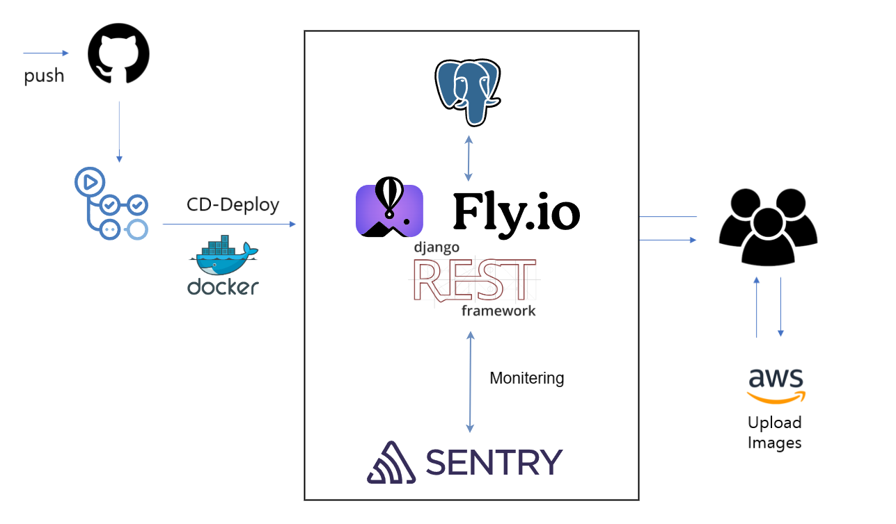
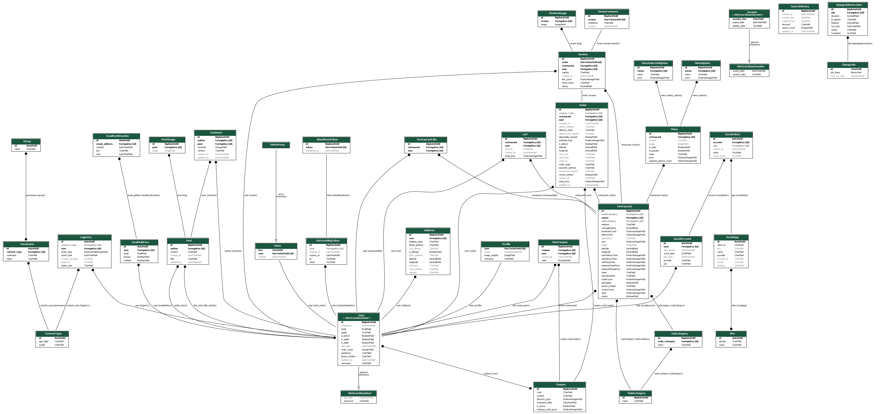

# 푸드브릿지 

배달 음식점과 소비자를 연결하는 중개 플랫폼입니다 

> 배포 링크 <br />
> **https://foodbridge.vercel.app**

## 📄 목차

- [📄 목차](#-목차)
- [✍🏻 프로젝트 개요](#-프로젝트-개요)
- [🥰 팀원 소개](#-팀원-소개)
- [🍭 핵심 기능](#-핵심-기능)
  - [소셜 로그인 기능](#소셜-로그인-기능)
  - [음식점 기능](#음식점-기능)
  - [주문 / 장바구니 기능](#주문-장바구니-기능)
  - [주소 등록 기능](#주소-등록-기능)
  - [할인쿠폰 등록 및 사용 기능](#할인쿠폰-등록-및-사용-기능)
  - [마이페이지 기능](#마이페이지-기능)
  - [커뮤니티 기능](#커뮤니티-기능)
- [🍪 기술 스택](#-기술-스택)
- [🦾 시스템 아키텍처](#-시스템-아키텍처)
  - [폴더 구조](#-폴더-구조)
  - [아키텍처 구조](#-아키텍처-구조)
  - [ERD](#-erd)
- [🍰 Git & Code Convention](#-git--code-convention)
- [🍩 API Specification](#-api-specification)

<br />

## ✍🏻 프로젝트 개요

푸드브릿지는 여러 전국 배달음식점과 소비자를 연결하는 API 서버입니다.

<br />


## 🥰 팀원 소개
| [김국현(initNirvana)](https://github.com/initNirvana) | [장우진(dnwls16071)](https://github.com/dnwls16071) |
| :--------: | :--------: |
|  |  |
| Back-end | Back-end |

<br />

## 🍭 핵심 기능

### 소셜 로그인 기능

> 카카오톡/구글 소셜 로그인을 통해 간편한 회원가입이 가능합니다.

### 검색 기능

> 음식점 검색이 가능합니다. 최근 1시간내의 상위 10개의 검색어 순위 기능도 제공 하고 있습니다.

### 음식점 기능

> 음식점에 대해서 좋아요 및 메뉴, 선택 메뉴들을 볼 수 있습니다.

### 주문 / 장바구니 기능

> 주소, 가게 요청, 배달 기사 요청 등의 정보 검증 및 입력을 통해 주문 정보를 만듭니다.

### 주소 등록 기능

> 다음 API 활용 및 위경도값을 가져와 주소를 등록합니다.

### 할인쿠폰 등록 및 사용 기능

> 할인쿠폰을 등록하고 주문시 사용할 수 있습니다.

### 마이페이지 기능

> 주문 개수, 리뷰 개수 확인 및 프로필을 수정할 수 있습니다.

### 커뮤니티 기능

> 음식과 음식점에 대한 후기 및 평가 공유, 레시피 공유, 번개 모임 등을 통해 사용자들끼리 소통할 수 있습니다.

</aside>
<br />

## 🍪 기술 스택
### 🖥 Backend

|역할|종류|
|-|-|
|Framework||
|Database||
|Monitering tool||
|Programming Language||
|API|                                     
|Version Control|  |
|CICD| |
<br />

### 🖥 Common
|역할|종류|
|-|-|
|협업 관리| |
|디자인||
|소통|

<br />


## 🦾 시스템 아키텍처


### 📂 폴더 구조
```
📂 .github
┣ 📂 workflows
┃  ┣ fly_deploy.yml
📂 smartorder (메인)
📂 users
📂 search
📂 review
📂 restaurant
📂 order
📂 menu
📂 like
📂 coupon
📂 community
📂 cart 
fly.toml
Dockerfile
requirements.txt
```

<br />

### 📂 아키텍처 구조



<br />

### 📢 ERD



<br />

## 🍰 Git & Code Convention
### ✨ [ 푸드 브릿지의 코드 컨벤션 보러가기 (클릭!) ]()
### ✨ [ 푸드 브릿지의 기술 스택 보러가기 (클릭!) ]()


## 🍩 API Specification
### ✨ [ 푸드 브릿지의 API 명세서 보러가기 (클릭!) ]()
